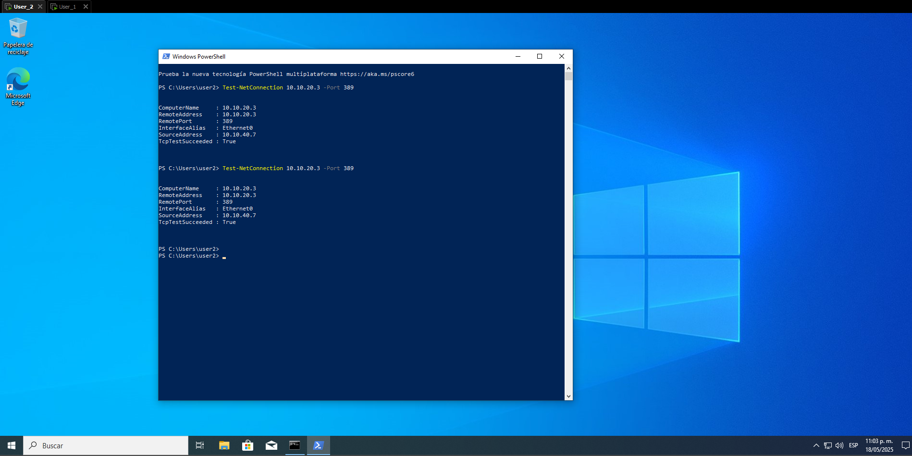

# 🧪 Pruebas de Segmentación y Reglas de Firewall

Este documento contiene las pruebas realizadas para validar el correcto funcionamiento de la segmentación de red mediante VLANs y las reglas configuradas en el firewall.

---

## 🔒 Prueba 1: Aislamiento entre VLANs

### 🎯 Objetivo

Comprobar que no exista comunicación entre VLANs distintas sin autorización explícita en el firewall.

### 🧪 Entorno

- VLAN10 (Administración) – 10.10.10.5
- VLAN30 (Usuarios) – 10.10.30.4
- VLAN40 (Invitados) – 10.10.40.7
- Firewall: WatchGuard - 192.168.37.136

---

### 🔧 Procedimiento

**Paso 1:** Ejecutar ping desde VLAN10 hacia VLAN30 y VLAN40.

```bash
ping 192.168.30.10
ping 192.168.40.10
```
→ Debe mostrar Request timed out o 100% packet loss, indicando que el ICMP fue bloqueado.

<p align="center">  </p>
<p align="center">  </p>

> 📌 **Descripción:** Evidencia visual del intento de ping desde VLAN10 hacia VLAN30-40. El resultado "Request timed out" valida que la política de aislamiento entre VLANs está aplicada correctamente.
 
----
**Paso 2:** Verificar los registros de tráfico bloqueado en el firewall (Traffic Monitor o Log Server).

→ Se deben observar intentos bloqueados entre VLANs por las políticas `deny`.

<p align="center">  </p>

> 📌 **Descripción:** Captura del monitor de tráfico del firewall mostrando intentos de comunicación denegados entre VLANs. Este registro es evidencia de que las reglas deny están activas y funcionando.

---

## 🔐 Prueba 2: Acceso controlado hacia el Servidor AD

### 🎯 Objetivo

Verificar que las VLANs autorizadas pueden acceder únicamente a los servicios específicos habilitados en el servidor de Active Directory (AD).

### 🧪 Entorno

- Servidor AD: 10.10.20.3 – VLAN20
- Clientes desde VLAN10, VLAN30, VLAN40
- Servicios habilitados: DNS, LDAP, Kerberos, SMB, RPC, HTTP/HTTPS

---

### 🔧 Procedimiento

**Paso 1:** Verificar resolución DNS desde un cliente autorizado.

```bash
nslookup ad.cbtech.local 10.10.20.3
```

→ Debe devolver correctamente la IP del servidor AD.

---

<p align="center">  </p>

> 📌 **Descripción:**Resultado exitoso del comando nslookup desde VLAN10. Se confirma que el servicio DNS hacia el servidor AD está disponible como lo permite la política del firewall.


**Paso 2:** Realizar consulta LDAP contra el servidor AD.

### 🎯 Objetivo.

Confirmar que el puerto 389 (LDAP) del controlador de dominio `10.10.20.3` responde correctamente.

```bash
Test-NetConnection 10.10.20.3 -Port 389
```
→ Debe mostrar: TcpTestSucceeded : True, lo cual indica que el puerto 389 está abierto y funcional.

<p align="center">  </p>
<p align="center">  </p>

> 📌 Descripción: Resultado exitoso del comando Test-NetConnection desde un cliente de red. Se observa TcpTestSucceeded : True, lo que confirma que el puerto LDAP está accesible y sin bloqueo por parte del firewall.

---

**Paso 3:** Escanear puertos permitidos desde un cliente hacia el servidor AD.

```bash
nmap -Pn -p 53,389,445,88,135 10.10.20.3
```
→ Los puertos configurados como permitidos deben aparecer como `open`.

<p align="center">  </p>

> 📌 Descripción: Resultado del escaneo Nmap desde un cliente en VLAN autorizada hacia el servidor AD. Se observa que los puertos DNS (53), LDAP (389), Kerberos (88), SMB (445) y RPC (135) aparecen como open, confirmando que las reglas del firewall permiten correctamente el tráfico hacia estos servicios esenciales.

---

**Paso 4:** Verificar en los registros del firewall el tráfico autorizado y bloqueado.

→ Solo los servicios definidos en las reglas deben aparecer como permitidos.

<p align="center">  </p>
<p align="center">  </p>

>📌 Descripción: Comparativa entre registros de tráfico autorizado (primera imagen) y tráfico bloqueado (segunda imagen), evidenciando el comportamiento controlado del firewall.

------
