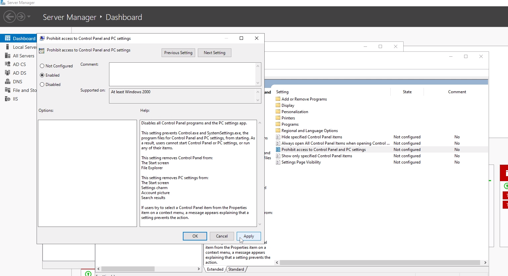
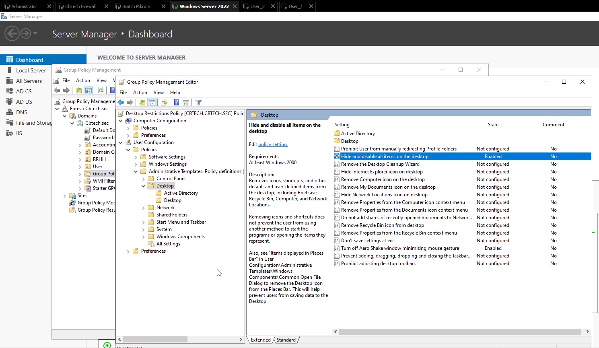
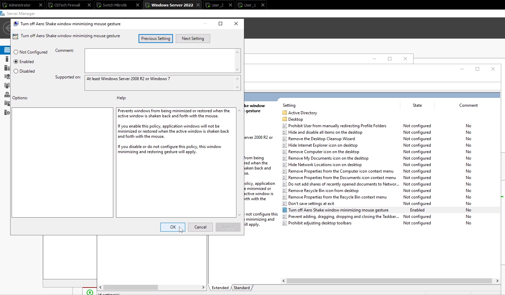

# 🛡️ Política GPO: Desktop Restrictions Policy.

## 📄 Descripción.

Esta política establece restricciones en el escritorio de estaciones de trabajo Windows con el objetivo de minimizar riesgos de seguridad, evitar configuraciones indebidas por parte de los usuarios y fortalecer la postura de seguridad general del entorno. Se aplica a través de una GPO en el dominio.


## 🎯 Objetivo.

Restringir el acceso a funcionalidades del escritorio y configuración de usuario en sistemas Windows para prevenir cambios no autorizados, proteger la información y cumplir con controles de seguridad establecidos por la norma ISO/IEC 27001.

## 📍 Alcance.

- Aplicable a todos los **usuarios finales** dentro del dominio CBTECH_SEC.
- Se excluyen administradores del sistema y usuarios de mantenimiento.


## ⚙️ Configuraciones GPO implementadas

| Restricción                                      | Ruta GPO                                                                                     | Estado     |
|--------------------------------------------------|----------------------------------------------------------------------------------------------|------------|
| Bloquear acceso a Panel de control               | Usuario > Plantillas administrativas > Panel de control                                     | Habilitado |
| Impedir cambio de fondo de pantalla              | Usuario > Plantillas administrativas > Panel de control > Personalización                   | Habilitado |
| Desactivar menú contextual del escritorio        | Usuario > Plantillas administrativas > Escritorio                                           | Habilitado |
| Ocultar elementos del escritorio                 | Usuario > Plantillas administrativas > Escritorio                                           | Habilitado |
| Restringir acceso a unidades (C:, D:)            | Usuario > Plantillas administrativas > Explorador de archivos                               | Habilitado |
| Bloquear ejecución de programas (ej: cmd, regedit)| Usuario > Plantillas administrativas > Sistema                                               | Habilitado |


## 📌 Alineación con ISO/IEC 27001

| Control ISO/IEC 27001       | Descripción                                                         |
|-----------------------------|----------------------------------------------------------------------|
| A.6.2.1 - Responsabilidades del usuario | Limita funcionalidades para reforzar el uso responsable del sistema. |
| A.9.2.3 - Gestión de privilegios        | Aplica el principio de mínimo privilegio al entorno gráfico.        |
| A.11.2.6 - Protección contra malware    | Evita la ejecución de software no autorizado.                       |
| A.13.1.3 - Separación lógica            | Refuerza controles de acceso visual y funcional en estaciones.      |
| A.18.1.4 - Privacidad y protección      | Minimiza riesgos de modificación o fuga de datos por accesos no autorizados. |

---

## 🛠️ Configuración mediante GPO.

- Abrir `gpmc.msc`
- Crear una nueva GPO con nombre sugerido: `RDP Access Policy`
- Vincularla a la OU que contiene los equipos donde se aplicará.

### 📁 1. Restringir acceso a panel de control y configuración.

<p align="center">
  
</p>

```python
User Configuration/Policies/Administrative Templates/Control Panel

> Prohibit access to Control Panel adn PC settings → `Enabled`
```

✅ Prohibir el acceso al panel de control y a configuración.


### 🖼️ 2. Eliminar acceso a opciones de personalización.

<p align="center">
  
</p>

```python
User Configuration/Policies/Administrative Templates/Control Panel/Personalization

> Prevent changing desktop background → `Enabled`
> Prevent changing theme → `Enabled`
```

✅ Impedir el cambio del fondo de escritorio.
✅ Impedir el cambio de temas.

### 🖱️ 3. Deshabilitar clic derecho en el escritorio.

<p align="center">
  
</p>

```python
User Configuration/Policies/Administrative Templates/Desktop

> Turn off Aero Shake windows minimizing mouse gesture → `Enabled`
```

✅ Desactivar menú contextual del escritorio.

### 🗃️ 4. Ocultar iconos del escritorio.

<p align="center">
  
</p>

```python
User Configuration/Policies/Administrative Templates/Desktop

> Hide and disable all items on the desktop  → `Enabled`
```

✅ Ocultar y deshabilitar todos los elementos del escritorio.

### 🔒 5. Restringir acceso a unidades.

<p align="center">
  
</p>

```python
User Configuration/Policies/Administrative Templates/Windows Components/File Explorer

> Prevent access to drives from My Computer → `Enabled
```

✅ Impedir el acceso a unidades del equipo (por ejemplo: C:, D:) → Seleccionar según política

✅ Evitar que los usuarios agreguen archivos a la raíz de las unidades.

### 🧮 6. Evitar ejecución de ciertos programas.

<p align="center">
  
</p>

```python
User Configuration/Policies/Administrative Templates/System

> Don not run specified Windows applications → `Enabled
```

✅ No ejecutar aplicaciones especificadas de Windows → Agregar lista de programas prohibidos (ej. cmd.exe, regedit.exe)