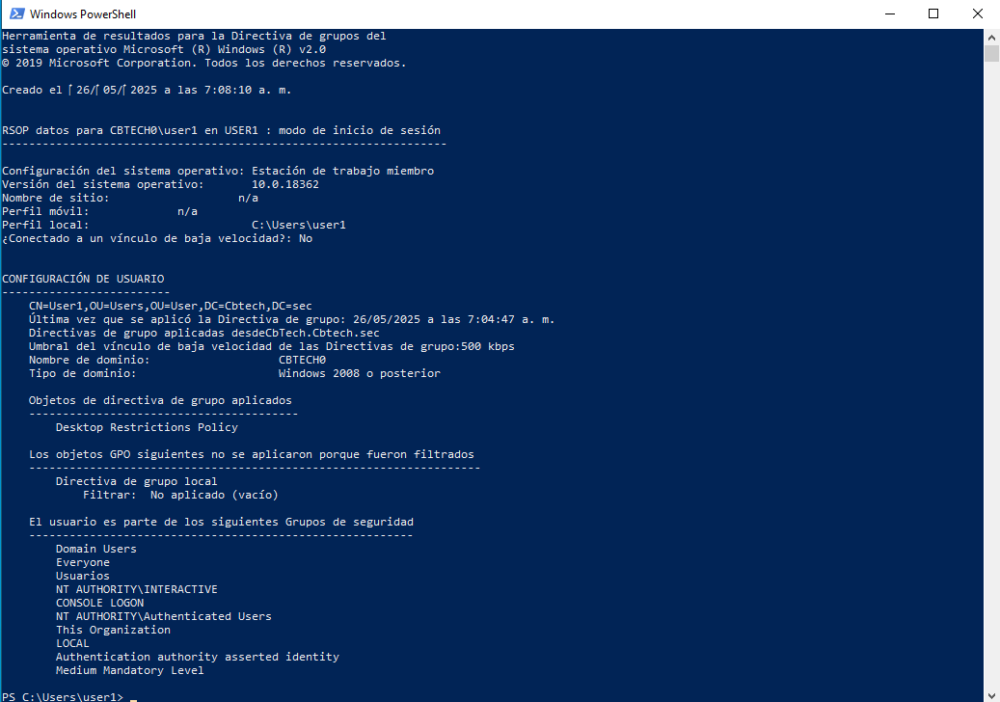
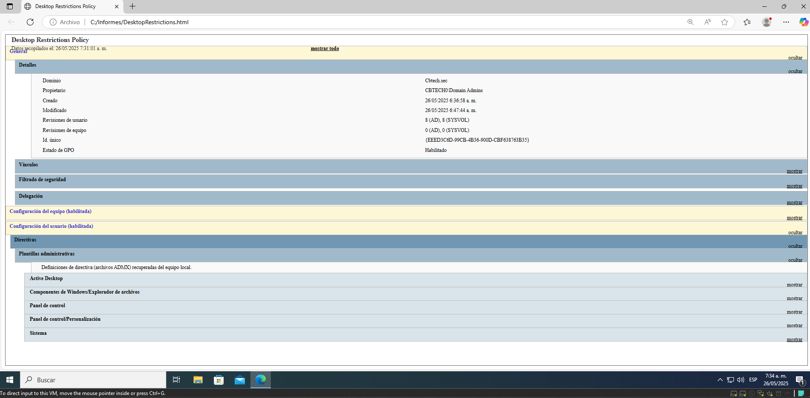

# ✅ Validación de Políticas GPO - Desktop Restrictions Policy.

## 🧪 Objetivo.

Verificar y documentar la correcta aplicación de la GPO **"Desktop Restrictions Policy"** en los equipos cliente del dominio CBTECH_SEC.

---

## 📋 Datos de la GPO.

- **Nombre:** Desktop Restrictions Policy  
- **Tipo:** GPO de usuario  
- **Aplicación:** OU `Usuarios_Estandar`  
- **Fecha de implementación:** [DD/MM/AAAA]  
- **Administrador responsable:** [Nombre del responsable]

---

## 🧭 Pasos de validación.

### 1️ Actualizar políticas en cliente.


```bash
gpupdate /force
```

### 2 Verificar políticas aplicadas al usuario. 

```bash
gpresult /r
```
Resultado esperado:
Debe aparecer "Desktop Restrictions Policy" en la sección "Directivas de usuario aplicadas".

### 4 Validar restricciones manualmente.

| Restricción                               | Resultado esperado                                       | Resultado obtenido |
| ----------------------------------------- | -------------------------------------------------------- | ------------------ |
| Bloqueo del Panel de control              | No se permite abrir Panel de control                     | ✅ / ❌              |
| Fondo de escritorio bloqueado             | No se permite cambiar fondo                              | ✅ / ❌              |
| Sin clic derecho en escritorio            | Clic derecho inhabilitado                                | ✅ / ❌              |
| Iconos del escritorio ocultos             | Escritorio aparece vacío                                 | ✅ / ❌              |
| Acceso restringido a unidades del sistema | No se puede acceder a disco C:, D: (según configuración) | ✅ / ❌              |
| No ejecución de cmd y regedit             | Error al intentar ejecutar `cmd.exe` o `regedit.exe`     | ✅ / ❌              |

## Evidencia.

<p align="center">
  
</p>

<p align="center">
  
</p>

<p align="center">
  
</p>


### 4 Generar evidencia .

<p align="center">
  
</p>

Para generar un informe, creamos la ruta dode quedara el archivo, agrgamos la caracteristica y enseguida generamos el informe.
```powershell
PS C:\Windows\system32>
PS C:\Windows\system32> New-Item -Path "C:\Informes" -ItemType Directory -Force

    Directorio: C:\


Mode                LastWriteTime         Length Name
----                -------------         ------ ----

PS C:\Windows\system32>
PS C:\Windows\system32> Add-WindowsCapability -Online -Name "Rsat.GroupPolicy.Management.Tools~~~~0.0.1.0"

Path          :
Online        : True
RestartNeeded : False

PS C:\Windows\system32>
PS C:\Windows\system32>Get-GPOReport -Name "Desktop Restrictions Policy" -ReportType Html -Path "C:\Informes\DesktopRestrictions.html"
```

Resultado esperado:
Archivo HTML con el detalle completo de la configuración de la política.