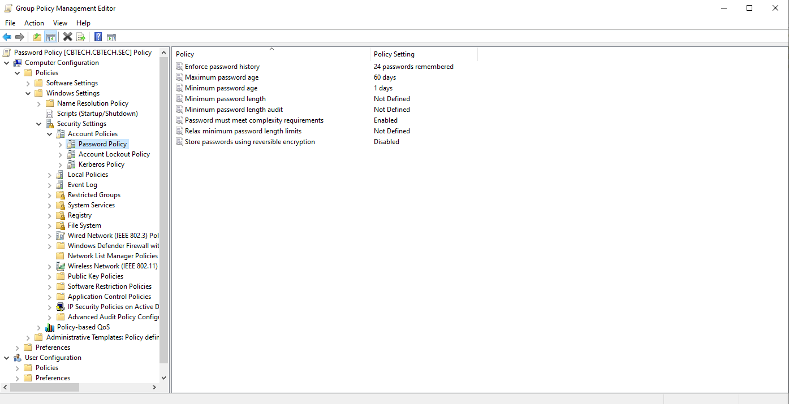
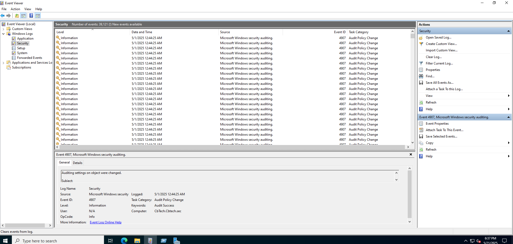

# 🧪 Validación y Pruebas Realizadas: Políticas de Contraseñas y GPO.

## 🎯 Objetivo.

Documentar pruebas realizadas para validar la correcta aplicación de políticas de contraseñas y seguridad en estaciones cliente del dominio, de acuerdo con controles de la norma **ISO/IEC 27001** (principalmente del dominio A.9 - Control de acceso).

---

## Políticas configuradas y verificadas.

### 1. Longitud mínima de la contraseña (≥ 12 caracteres).

**Ruta GPO:**  
`Computer Configuration/Policies/Windows Settings/Account Policies
> Password Policy`

📌 **Validación:**  
- Se intentó establecer una contraseña de 8 caracteres → ❌ Rechazada  
- Contraseña de 20 caracteres → ✅ Aceptada

<p align="center">
  
</p>
<p align="center">
  
</p>
---

### 2. Complejidad de contraseña habilitada.

📌 **Validación:**  
- Contraseña sin mayúsculas, números o símbolos → ❌ Rechazada  
- Contraseña con combinación de al menos 3 grupos → ✅ Aceptada

<p align="center">
  
</p>
<p align="center">
  
</p>
---

### 3. Historial de contraseñas (24 entradas).

📌 **Validación:**  
- Intento de reutilizar una contraseña anterior → ❌ Rechazado

<p align="center">
  
</p>
---

### 4. Duración mínima de la contraseña (1 día).

📌 **Validación:**  
- Intento de cambio inmediato tras cambiar contraseña → ❌ Rechazado

<p align="center">
  
</p>
---

---

### 5. Duración máxima de la contraseña (60 días).

📌 **Validación:**  
- Política aplicada y forzada con `gpupdate`  
- Verificación en `rsop.msc` → ✅ Correcto

<p align="center">
  
</p>

---

### 6. Umbral de bloqueo de cuenta (5 intentos).

📌 **Validación:**  
- Se realizaron 5 intentos fallidos de inicio de sesión  
- Cuenta bloqueada automáticamente → ✅

<p align="center">
  
</p>

---

### 7. Duración del bloqueo de cuenta (30 minutos).

📌 **Validación:**  
- Bloqueo activo durante 30 minutos → ✅ Reactivación automática

<p align="center">
  
</p>


### 9. Cifrado reversible deshabilitado.

📌 **Validación:**  
- Confirmado en configuración GPO  
- Asegura que contraseñas no se almacenen en texto plano

<p align="center">
  
</p>

---

### 10. Auditoría de cambios de contraseña y bloqueos.

📌 **Ruta:**  
`Visor de eventos > Seguridad` o Windows + R  y escribe  `eventvwr.msc`.

📌 **Eventos clave observados:**  
- `ID 4723` - Cambio de contraseña de cuenta  
- `ID 4740` - Cuenta de usuario bloqueada

<p align="center">
  
</p>

---

## 🔎 Comandos utilizados.

```bash
gpupdate /force
gpresult /r
rsop.msc
gpmc.msc
eventvwr.msc
```

### ✅ Conclusión.

Las 10 políticas fueron correctamente aplicadas y verificadas, cumpliendo con los requisitos de control de acceso exigidos por ISO/IEC 27001 (particularmente los controles A.9.2.1 y A.9.4.2), fortaleciendo así la postura de seguridad del entorno del dominio.