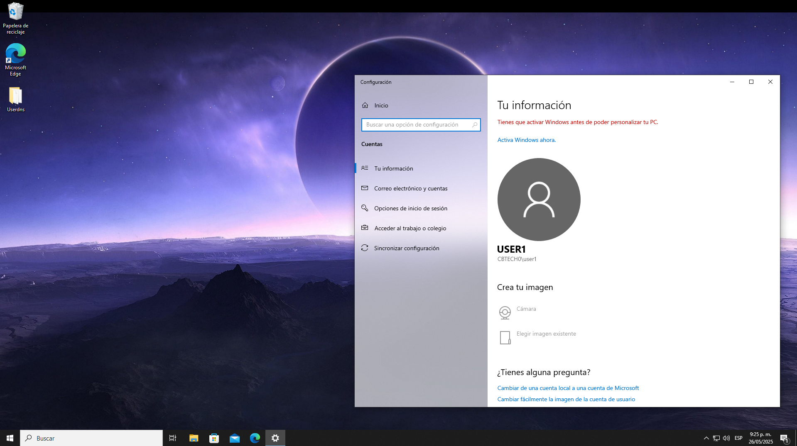
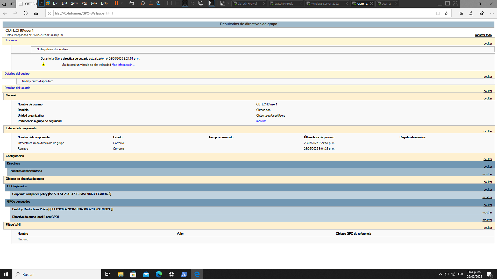

# 🖼️ Política GPO: Corporate Wallpaper & Lock Screen Policy.

## 📄 Descripción.

Esta política define la configuración centralizada del fondo de escritorio y la pantalla de bloqueo en los equipos cliente del dominio CBTECH_SEC, con el objetivo de reforzar la identidad corporativa, reducir configuraciones manuales y promover la concienciación en seguridad de la información.


## 🎯 Objetivo.

- Establecer un fondo corporativo institucional.
- Definir una pantalla de bloqueo estándar.
- Evitar cambios no autorizados por parte de los usuarios.


## 📍 Alcance.

- Equipos: Estaciones de trabajo bajo Windows 10 y Windows 11.
- Usuarios: Todo usuario estándar del dominio.
- Exclusiones: Equipos del área de TI y cuentas administrativas.

---

## 🛠️ Configuración mediante GPO.

- Abrir `gpmc.msc`
- Crear una nueva GPO con nombre sugerido: `Corporate-wallpaper-policy`
- Vincularla a la OU que contiene los equipos donde se aplicará.

### 📁 1. Configurar fondo de escritorio desde GPO.

<p align="center">
  
</p>

```python
User Configuration/Policies/Administrative Templates/Desktop/Desktop

> Enable Active Desktop → `Enabled`
> Desktop Wallpaper → `Enabled`
- Wallpaper Name:
\\CbTech\Wallpaper\Cbtech_sec.jpg
```
```python
User Configuration/Policies/Administrative Templates/Desktop

> Prevent changuing desktop background → `Enabled`
```

### Pantalla de bloqueo. 

<p align="center">
  
</p>

```python
Computer Configuration/Policies/Administrative Templates/Personalization

> Force a specific default lock screen and logon image → `Enabled`
- Path to lock screen image: `C:\Wallpaper\Cbtech_sec-fund.jpg`

> ⚠️ **Requiere que la imagen exista localmente en cada equipo.**
```

Para ello creamos una carpeta local a cada cliente o usuario.

**Script de inicio sugerido (PowerShell):**

```powershell
#Creo la carpeta en el usuario para guardar la imagen local.
if (-Not (Test-Path -Path "C:\Wallpaper")) {
    New-Item -Path "C:\Wallpaper" -ItemType Directory
}

# Pruebo que exista la ruta.
Test-Path "C:\Wallpaper"
True

# Copio la imagen
Copy-Item -Path "\\CbTech\Wallpaper\Cbtech_sec-fund.jpg" -Destination "C:\Wallpaper" -Force

```

### 📎 Evidencia de implementación.

- Capturas del fondo aplicado y pantalla de bloqueo.

<p align="center">
  
</p>

<p align="center">
  
</p>

- Reporte HTML con powershell: 

```powershell
gpresult /h "C:\Informes\GPO-Wallpaper.html"
start "C:\Informes\GPO-Wallpaper.html"
``` 

<p align="center">
  
</p>